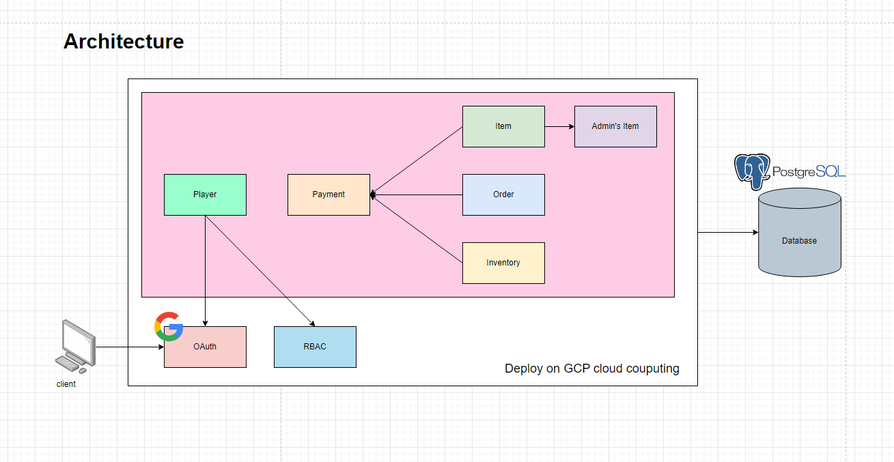

### Isekai Shop API
Working is now on progress ...

### Architecture


### Start PostgreSQL on Docker

1. Pull the PostgreSQL image

    ```bash
    docker pull postgres:alpine
    ```
2. Start the PostgreSQL container

    ```bash
    docker run --name isekaishopdb -p 5432:5432 -e POSTGRES_PASSWORD=123456 -d postgres:alpine
    ```
3. Create the Isekai Shop Database

    ```bash
    psql -U postgres
    ```
    ```bash
    CREATE DATABASE isekaishopdb;
    ```
4. In case you need to delete the database

    ```bash
    DROP DATABASE isekaishopdb;
    ```

### Database Migration

```bash
go run ./databases/migration/migratedb.go
```

### config.yaml Example

```bash
server:
  port: 8080
  allowOrigins:
    - "*"
  bodyLimit: "10M" # MiB
  timeout: 30 # Seconds

oauth2:
  clientId: "xxxxx"
  clientSecret: "xxxx"
  redirectUrl: "http://localhost:8080/v1/oauth2/google/login/callback"
  endpoints:
    authUrl: "https://accounts.google.com/o/oauth2/auth?access_type=offline&approval_prompt=force"
    tokenUrl: "https://oauth2.googleapis.com/token"
    deviceAuthUrl: "https://oauth2.googleapis.com/device/code"
  scopes:
    - "https://www.googleapis.com/auth/userinfo.email"
    - "https://www.googleapis.com/auth/userinfo.profile"
  userInfoUrl: "https://www.googleapis.com/oauth2/v2/userinfo"
  revokeUrl: "https://accounts.google.com/o/oauth2/revoke"

state:
  secret: "supersecret"
  expiresAt: 120 # Seconds
  issuer: "isekaishop"
  
database:
  host: localhost
  port: 5432
  user: postgres
  password: 123456
  dbname: isekaishopdb
  sslmode: disable
  schema: public
```