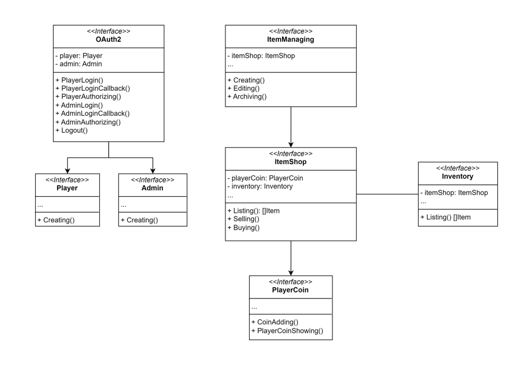
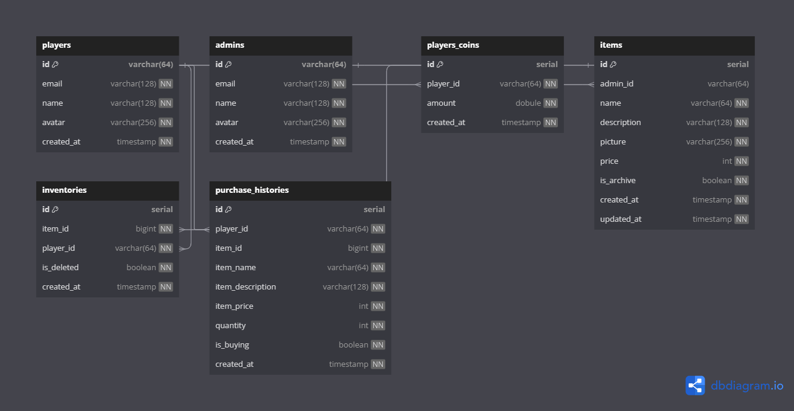

# Isekai Shop API
**Published by** Ruangyot Nanchiang.

## Introduction

Hi, my name is Ruangyot Nanchiang from Thailand, or you can call me Rayato159. I have been working as a backend developer for 2 years and am familiar with Golang.

Before this, I had published two online courses about Golang backend, covering both monolithic and microservices. However, both courses are in the Thai language.

This course will guide you through the implementation of a Simple REST API in clean architecture using **Golang + Echo + Gorm (PostgreSQL)**, starting from scratch and designed to be beginner-friendly, taking you from zero to hero.

## About Isekai Shop API

This course project is named “Isekai Shop API.” “Isekai” means another world (If you are an anime fan, you probably already know this world, lol), So this project is going to act like CRUD project + OAuth2.

## Features of Isekai Shop API

- Item Shop
  - Listing
  - Selling
  - Buying
- Item Managing
  - Creating
  - Editing
  - Archiving
- Inventory
  - Listing
- Player Coin
  - Coin Adding
  - Showing
- OAuth2
  - Player Login
  - Admin Login
  - Logout
  - Middleware
      - Player Authorize
      - Admin Authorize

## Architecture


## ER Diagram


## Start PostgreSQL on Docker

1. Pull the PostgreSQL image

    ```bash
    docker pull postgres:alpine
    ```
2. Start the PostgreSQL container

    ```bash
    docker run --name isekaishopdb -p 5432:5432 -e POSTGRES_PASSWORD=123456 -d postgres:alpine
    ```
3. Create the Isekai Shop Database

    ```bash
    docker exec -it isekaishopdb bash
    ```

    ```bash
    psql -U postgres
    ```
    ```bash
    CREATE DATABASE isekaishopdb;
    ```
4. In case you need to delete the database

    ```bash
    DROP DATABASE isekaishopdb;
    ```

## Database Migration

```bash
go run ./databases/migration/migratedb.go
```

## config.yaml Example

```bash
server:
  port: 8080
  allowOrigins:
    - "*"
  bodyLimit: "10M" # MiB
  timeout: 30 # Seconds

oauth2:
  playerRedirectUrl: "http://localhost:8080/v1/oauth2/google/player/login/callback"
  adminRedirectUrl: "http://localhost:8080/v1/oauth2/google/admin/login/callback"
  clientId: "xxxxx.apps.googleusercontent.com"
  clientSecret: "xxxxx"
  endpoints:
    authUrl: "https://accounts.google.com/o/oauth2/auth?access_type=offline&approval_prompt=force"
    tokenUrl: "https://oauth2.googleapis.com/token"
    deviceAuthUrl: "https://oauth2.googleapis.com/device/code"
  scopes:
    - "https://www.googleapis.com/auth/userinfo.email"
    - "https://www.googleapis.com/auth/userinfo.profile"
  userInfoUrl: "https://www.googleapis.com/oauth2/v2/userinfo"
  revokeUrl: "https://accounts.google.com/o/oauth2/revoke"
  
database:
  host: localhost
  port: 5432
  user: postgres
  password: 123456
  dbname: isekaishopdb
  sslmode: disable
  schema: public
```

## Start Isekai Shop API using Docker

Let's see the IPv4 of our database container first by this follwing command.

```bash
docker network inspect bridge
```

Then copy the IPv4 of isekaishopdb to change the host of database in the config.yaml.

And now let's build and start the isekai-shop-api through the Docker.

```bash
docker build -t isekai-shop-api:v1.0.0 .
```

```bash
docker run --name isekai-shop-api -v /path/to/config-folder:/app/etc -d isekai-shop-api:v1.0.0
```

## Postman Collection and ENV
- [Collection](./postman/isekai-shop-api.postman_collection.json)